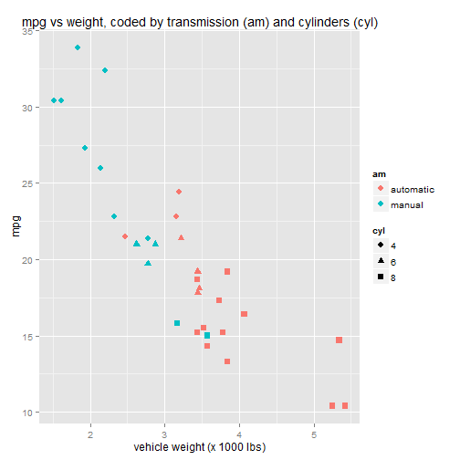
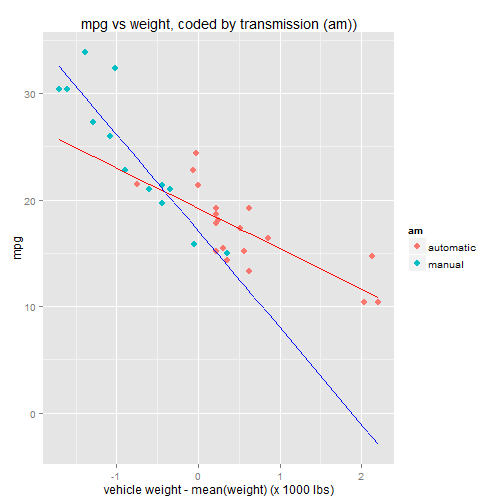
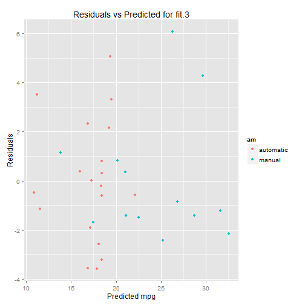
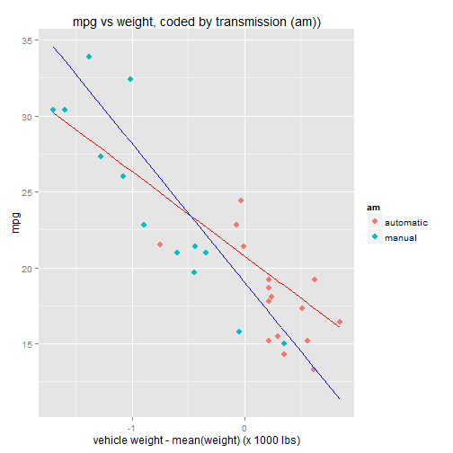
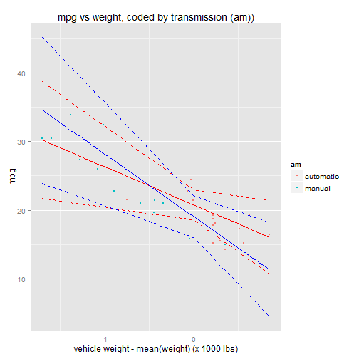
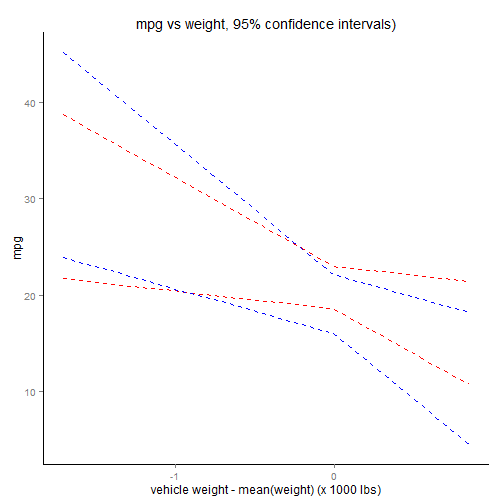

# Investigate the Relationship Between Fuel Consumption and Transmission Type of Automobiles

## Abstract

This report investigates the relationship between fuel consumption and transmission type for
automobiles.  The report analyzes fuel consumption along with various design and performance metrics
for 32 vehicles, all 1973-1974 models.  The data suggest that automatic transmissions have better
fuel performance for heavier vehicles, whereas manuals have better fuel performance for lighter
vehicles.  However the results are questionable due to high correlation between transmission type
and vehicle weight in the data.  The 95% confidence intervals for the two transmission types
show a great deal of overlap, which indicates that the difference in fuel consumption 
between transmission types may be negligible. 


## Exploratory Analysis

For this analysis we'll explore the "mtcars" dataset provided by the "datasets" library in R.
The mtcars data was extracted from a *Motor Trend* magazine.  It contains 11 variables measuring
various aspects of design, performance, and fuel consumption for 32 automobiles, all of which
are 1973 - 1974 models.  We will focus our analysis on fuel consumption (mpg) versus transmission (am).

The help article for the mtcars dataset gives a brief description of its variables:

```
[, 1] 	mpg 	Miles/(US) gallon
[, 2] 	cyl 	Number of cylinders
[, 3] 	disp 	Displacement (cu.in.)
[, 4] 	hp 	Gross horsepower
[, 5] 	drat 	Rear axle ratio
[, 6] 	wt 	Weight (lb/1000)
[, 7] 	qsec 	1/4 mile time
[, 8] 	vs 	V/S
[, 9] 	am 	Transmission (0 = automatic, 1 = manual)
[,10] 	gear 	Number of forward gears
[,11] 	carb 	Number of carburetors 
```

First let's explore the data to get an idea of what it looks like.   The first scatter plot below
plots fuel consumption (mpg) vs weight (wt).  The points are color-coded by transmission (am) and
shape-coded by cylinders (cyl).


```r
library(datasets)
data(mtcars)

# give meaningful labels to encoded factors
mtcars$am <- factor(mtcars$am, labels=c("automatic","manual"))

# convert to a factor variable, for convenience
mtcars$cyl <- factor(mtcars$cyl)
    
ggplot(mtcars, aes(x=wt, y=mpg)) + 
    geom_point(aes(colour=am, shape=cyl), size=3) + 
    xlab("vehicle weight (x 1000 lbs)") +
    ggtitle("mpg vs weight, coded by transmission (am) and cylinders (cyl)")
```

 

The chart reveals a few things.  First there's a clear, negative correlation between weight and mpg.
Second, there's also a clear correlation between transmission and weight:  notice that 
manual transmissions (blue dots) are correlated with light-weight vehicles, while automatics (red dots)
are correlated with heavier vehicles.  We must take this into account in our model,
given the clearly negative correlation between between weight and mpg. If weight were randomly distributed
evenly across the two transmissions, then we might be able to ignore it; however since that is not
the case, we should include weight in our model.

There also appears to be a correlation between cylinders and weight, so we can probably exclude cylinders
from our model, since much of the information it contributes is already captured by the weight variable,
since they appear to be correlated.


## Regression Analysis 

So let's begin our analysis with a linear model that compares fuel consumption (mpg) with two regressor variables:
transmission (am) and weight (wt). 


```r
fit.1 <- lm( mpg ~ am + wt, data=mtcars )
```

Before we analyze the output, let's remind ourselves what the coefficients actual represent.  The linear model
above, lm( mpg ~ am + wt), corresponds to the regression equation:

    mpg = B0 + B1 * (am == manual) + B2 * wt

...where:

* B0 corresponds to the base factor level am == automatic.  It represents the mpg value for automatics when weight = 0.
* B1 corresponds to the factor level am == manual.  It represents the *difference* in mpg between a manual and an automatic when weight = 0.
* B2 represents the change in mpg per unit change in weight (where the unit of weight is 1000 lbs) holding all other variables, i.e the transmission, constant.


Note that weight=0 is a meaningless value, since there's no such thing as a car with zero weight.  We can get more meaningful
coefficients for B0 and B1 by shifting the weight by the mean weight.  This causes the B2 term to drop out (go to zero) when
weight = mean(weight), leaving the remaining coefficients to be interpreted as the effect of their variables on a car with an average weight.


```r
fit.2 <- lm( mpg ~ am + I(wt-mean(wt)), data=mtcars )

B0 <- summary(fit.2)$coefficients[1,1]
B1 <- summary(fit.2)$coefficients[2,1]
B2 <- summary(fit.2)$coefficients[3,1]

summary(fit.2)$coefficients
```

```
##                     Estimate Std. Error     t value     Pr(>|t|)
## (Intercept)      20.10021868  0.8331837 24.12459551 9.639957e-21
## ammanual         -0.02361522  1.5456453 -0.01527855 9.879146e-01
## I(wt - mean(wt)) -5.35281145  0.7882438 -6.79080719 1.867415e-07
```

Now our regression equation becomes:

    mpg = B0 + B1 * (am == manual) + B2 * (wt-mean(wt))

... and our coefficients are interpreted as follows:

* B0=20.1, represents the mpg value for automatics when weight = mean(weight).
* B1=-0.02, represents the difference in mpg value between manuals and automatics when weight = mean(weight).
* B2=-5.35, represents the change in mpg per unit change in weight, holding transmission constant.

Note that this creates a linear model with two lines: one for automatics, and another for manuals.  The Y-intercept of
the line for am=automatic is B0.  The Y-intercept of the line for am=manual is B0+B1.  The slope of both lines is
the same, B2:

    mpg[am=automatic] = B0 + B2 * wt
    mpg[am=manual] = (B0 + B1) + B2 * wt

Notice that the value for B1 is small, meaning the difference in mpg between automatics and manuals at the
average weight is negligible. The p value for this difference, 0.988, indicates that the difference is not
very statistically significant either.  The p value associated with the weight variable however is very significant,
which is what we expected given the clearly negative correlation we observed during the exploratory phase.

So this model doesn't really help us quantify the difference in mpg between automatics and manuals. 
Let's try another one.  Let's investigate whether the interaction between weight and transmission has an effect.


```r
fit.3 <- lm(mpg ~ am * I(wt-mean(wt)), data=mtcars)
```

This results in a regression equation that looks like:

    mpg = B0 + B1 * (am==manual) + B2 * wt + B3 * wt * (am == manual)

...where coefficients B0, B1, and B2 are interpreted the same as before.  B3 is interpreted as the difference
in slope between the two lines this model generates: the line for automatics and the line for manuals.
The linear equations for the two lines are:

    mpg[am=automatic] = B0 + B2 * wt
    mpg[am=manual] = (B0 + B1) + (B2 + B3) * wt

Here it is clear to see that B3 is the change in slope between the two lines.


```r
B0 <- summary(fit.3)$coefficients[1,1]
B1 <- summary(fit.3)$coefficients[2,1]
B2 <- summary(fit.3)$coefficients[3,1]
B3 <- summary(fit.3)$coefficients[4,1]

summary(fit.3)$coefficients
```

```
##                            Estimate Std. Error   t value     Pr(>|t|)
## (Intercept)               19.235844  0.7356848 26.146856 3.243563e-21
## ammanual                  -2.167728  1.4188862 -1.527767 1.377893e-01
## I(wt - mean(wt))          -3.785908  0.7856478 -4.818836 4.551182e-05
## ammanual:I(wt - mean(wt)) -5.298360  1.4446993 -3.667449 1.017148e-03
```

The value of B1=-2.17, which represents the difference in mpg values between automatics and manuals at average weight,
is a little bigger than in our first model, but again has a small p value and therefore is not very significant.  However the value of B3=-5.3 ,
which represents the difference in slopes between the two transmissions, is statistically significant with p=0.001.
And finally the effect of weight, B2=-3.79 is negative and very significant.

Let's overlay our linear model on the scatter plot.  Note that we've shifted the weight axis by the mean weight.
    

```r
mtcars$wt.md <- mtcars$wt - mean(mtcars$wt)
lm.mpg.automatic <- with(mtcars, B0 + B2 * (wt.md))
lm.mpg.manual <- with(mtcars, B0 + B1 + (B2 + B3) * (wt.md))

ggplot(mtcars) + 
    geom_point(aes(x=wt.md, y=mpg, colour=am), size=3) + 
    xlab("vehicle weight - mean(weight) (x 1000 lbs)") +
    ggtitle("mpg vs weight, coded by transmission (am))") +
    geom_line(aes(y=lm.mpg.automatic,x=wt.md), colour="red") + 
    geom_line(aes(y=lm.mpg.manual,x=wt.md), colour="blue")  
```

 

The model suggests that manuals have better mpg than automatics at lower weights, but worse mpg
at higher weights.  

### Model Comparison

Let's compare the two models, fit.2 and fit.3. Since the models are nested -- fit.3 merely 
adds another variable (the interaction am : wt) to fit.2 -- we can do an anova comparison.


```r
anova(fit.2, fit.3)
```

```
## Analysis of Variance Table
## 
## Model 1: mpg ~ am + I(wt - mean(wt))
## Model 2: mpg ~ am * I(wt - mean(wt))
##   Res.Df    RSS Df Sum of Sq     F   Pr(>F)   
## 1     29 278.32                               
## 2     28 188.01  1    90.312 13.45 0.001017 **
## ---
## Signif. codes:  0 '***' 0.001 '**' 0.01 '*' 0.05 '.' 0.1 ' ' 1
```

The p value, 0.001, indicates a statistically significant difference between the two models,
which suggests that the interaction term is indeed significant and should be included in the model.


### Residuals and Diagnostics

First let's plot the model residuals vs. the model fit (predicted values) to look for patterns
in the residuals.


```r
qplot(y=resid(fit.3),
      x=predict(fit.3),
      data=mtcars,
      colour=am, 
      ylab="Residuals",
      xlab="Predicted mpg",
      main="Residuals vs Predicted for fit.3")
```

 

The residuals appear to be randomly distributed.  There does not appear to be a discernable pattern,
although there are a few outliers.

One problem with this model is that there aren't many observations across transmission types
that overlap in terms of weight.  In other words, most of our automatics are heavy, most of
our manuals are light, and there aren't many observations across the two transmissions at similar weights.
Also there are a few outliers in the data, particularly for heavy automatics, that may
be exerting a lot of influence on the result.  Let's see if we can account for that.

First let's quickly look at which data points exert the most leverage on the results by
analyzing their hat values:


```r
library(dplyr, warn.conflicts=F)
mtcars$hats <- hatvalues(fit.3)
head( mtcars %>% arrange(desc(hats)) %>% select(mpg,wt,am,hats) )
```

```
##    mpg    wt        am      hats
## 1 15.0 3.570    manual 0.3709866
## 2 10.4 5.424 automatic 0.3044512
## 3 14.7 5.345 automatic 0.2809856
## 4 10.4 5.250 automatic 0.2542871
## 5 30.4 1.513    manual 0.2534565
## 6 30.4 1.615    manual 0.2156307
```

As expected, three of the top four data points that have the most leverage correspond to our
three heavy outliers, all of which have wt > 5 (they are the only observations in the data with 
wt > 5).  Let's filter out these heavy automatics and re-apply our linear model:


```r
mtcars.2 <- mtcars %>% filter(wt < 5)
fit.4 <- lm(mpg ~ am * I(wt-mean(wt)), data=mtcars.2)

B0 <- summary(fit.4)$coefficients[1,1]
B1 <- summary(fit.4)$coefficients[2,1]
B2 <- summary(fit.4)$coefficients[3,1]
B3 <- summary(fit.4)$coefficients[4,1]

lm.mpg.automatic <- with(mtcars.2, B0 + B2 * (wt.md))
lm.mpg.manual <- with(mtcars.2, B0 + B1 + (B2 + B3) * (wt.md))

ggplot(mtcars.2) + 
    geom_point(aes(x=wt.md, y=mpg, colour=am), size=3) + 
    xlab("vehicle weight - mean(weight) (x 1000 lbs)") +
    ggtitle("mpg vs weight, coded by transmission (am))") +
    geom_line(aes(y=lm.mpg.automatic,x=wt.md), colour="red") + 
    geom_line(aes(y=lm.mpg.manual,x=wt.md), colour="blue")  
```

 

Notice that the two slopes are less different once the heavy automatics are removed.
Let's take a look at the coefficients.


```r
summary(fit.4)$coefficients
```

```
##                            Estimate Std. Error   t value     Pr(>|t|)
## (Intercept)               20.781027   1.073928 19.350486 1.471239e-16
## ammanual                  -1.718365   1.474379 -1.165484 2.548231e-01
## I(wt - mean(wt))          -5.532531   1.797864 -3.077281 5.011139e-03
## ammanual:I(wt - mean(wt)) -3.551737   2.167804 -1.638403 1.138640e-01
```

Note that B2=-5.53, which represents the slope coefficient 
for am=automatic, is larger (in absolute terms) than it was in fit.3 (which included the heavy automatics).
The difference between the two slopes, captured by B3=-3.55, is smaller than before. 
Also notice that the difference between the slopes is no longer very significant, with a p value
of 0.11.


## Confidence Intervals

Let's try to quantify the uncertainty in our model by plotting 95% confidence intervals for the two
regression lines.  The confidence intervals are governed by the standard errors of the coefficients,
which are reported in the model summary.  


```r
B0.se <- summary(fit.4)$coefficients[1,2]
B1.se <- summary(fit.4)$coefficients[2,2]
B2.se <- summary(fit.4)$coefficients[3,2]
B3.se <- summary(fit.4)$coefficients[4,2]

B0.conf <- B0 + c(-1,1) * qt(0.975, df=fit.4$df) * B0.se
B1.conf <- B1 + c(-1,1) * qt(0.975, df=fit.4$df) * B1.se
B2.conf <- B2 + c(-1,1) * qt(0.975, df=fit.4$df) * B2.se
B3.conf <- B3 + c(-1,1) * qt(0.975, df=fit.4$df) * B3.se

list(B0=B0.conf, B1=B1.conf, B2=B2.conf, B3=B3.conf)
```

```
## $B0
## [1] 18.56923 22.99282
## 
## $B1
## [1] -4.754906  1.318176
## 
## $B2
## [1] -9.235301 -1.829762
## 
## $B3
## [1] -8.0164137  0.9129402
```

Notice that B1 and B3 both include 0 in their 95% confidence intervals, which is expected given
that neither of them had a significant p value.

Let's plot the 95% confidence intervals on the chart for visual examination.  


```r
lm.mpg.automatic.lwr1 <- with(mtcars.2, B0.conf[1] + B2.conf[1] * (wt.md))
lm.mpg.automatic.lwr2 <- with(mtcars.2, B0.conf[1] + B2.conf[2] * (wt.md))
lm.mpg.automatic.lwr <- mapply(min, lm.mpg.automatic.lwr1, lm.mpg.automatic.lwr2)

lm.mpg.automatic.upr1 <- with(mtcars.2, B0.conf[2] + B2.conf[1] * (wt.md))
lm.mpg.automatic.upr2 <- with(mtcars.2, B0.conf[2] + B2.conf[2] * (wt.md))
lm.mpg.automatic.upr <- mapply(max, lm.mpg.automatic.upr1, lm.mpg.automatic.upr2)

lm.mpg.manual.lwr1 <- with(mtcars.2, B0 + B1.conf[1] + (B2 + B3.conf[1]) * (wt.md))
lm.mpg.manual.lwr2 <- with(mtcars.2, B0 + B1.conf[1] + (B2 + B3.conf[2]) * (wt.md))
lm.mpg.manual.lwr <- mapply(min, lm.mpg.manual.lwr1, lm.mpg.manual.lwr2)

lm.mpg.manual.upr1 <- with(mtcars.2, B0 + B1.conf[2] + (B2 + B3.conf[1]) * (wt.md))
lm.mpg.manual.upr2 <- with(mtcars.2, B0 + B1.conf[2] + (B2 + B3.conf[2]) * (wt.md))
lm.mpg.manual.upr <- mapply(max, lm.mpg.manual.upr1, lm.mpg.manual.upr2)

ggplot(mtcars.2) + 
    geom_point(aes(x=wt.md, y=mpg, colour=am), size=1) + 
    xlab("vehicle weight - mean(weight) (x 1000 lbs)") +
    ggtitle("mpg vs weight, coded by transmission (am))") +
    geom_line(aes(y=lm.mpg.automatic,x=wt.md), colour="red" ) + 
    geom_line(aes(y=lm.mpg.manual,x=wt.md), colour="blue" )  +
    geom_line(aes(y=lm.mpg.automatic.lwr,x=wt.md), linetype="dashed", colour="red")  +
    geom_line(aes(y=lm.mpg.automatic.upr,x=wt.md), linetype="dashed", colour="red")  +
    geom_line(aes(y=lm.mpg.manual.lwr,x=wt.md), linetype="dashed", colour="blue")  +
    geom_line(aes(y=lm.mpg.manual.upr,x=wt.md), linetype="dashed", colour="blue")  
```

 

For the purpose of clarity, the plot below removes the data points and regression lines to leave
just the confidence intervals.


```r
ggplot(mtcars.2) + 
    xlab("vehicle weight - mean(weight) (x 1000 lbs)") +
    ylab("mpg") +
    ggtitle("mpg vs weight, 95% confidence intervals)") +
    geom_line(aes(y=lm.mpg.automatic.lwr,x=wt.md), linetype="dashed", colour="red")  +
    geom_line(aes(y=lm.mpg.automatic.upr,x=wt.md), linetype="dashed", colour="red")  +
    geom_line(aes(y=lm.mpg.manual.lwr,x=wt.md), linetype="dashed", colour="blue")  +
    geom_line(aes(y=lm.mpg.manual.upr,x=wt.md), linetype="dashed", colour="blue")  +
    theme(panel.grid.major = element_blank(), panel.grid.minor = element_blank(), 
          panel.background = element_blank(), axis.line = element_line(colour = "black"))
```

 
    
As you can see the 95% confidence intervals show a great deal of overlap between the two
transmission types, which suggests that there may not be a significant difference in mpg
between them.


## Conclusion

The data is inconclusive as to whether there's a significant difference in fuel consumption
between automatic and manual transmissions.  The data suggests that automatics
have better fuel consumption than manuals for heavier vehicles, whereas manuals have
better fuel consumption for lighter vehicles; however these results may not be significant
due to the high correlation between transmission type and vehicle weight.  

